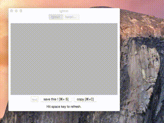

# LGTM app for OS X

# What
LGTM Mac app for all developers who love to LGTM.

# Support Version
OS X 10.10(Yosemite) or later

# Why
Yea I know maybe someone could make a cross-platform one using Electron or something.  
But I'm a Mac addict, so...

# Inspired by
https://github.com/rahulsom/lgtmin

# Contributing
- Send a Pull Request. (What else?)
- Wait for any reviewers to LGTM your code. (Very meta)
- Wait for your code to be merged.
